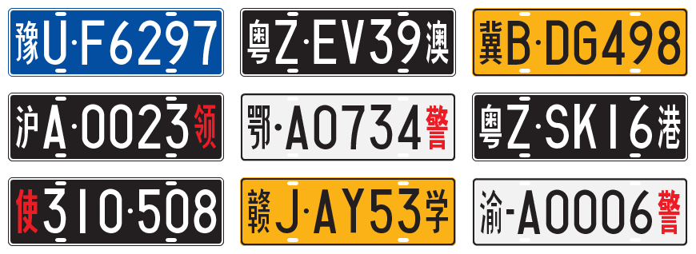
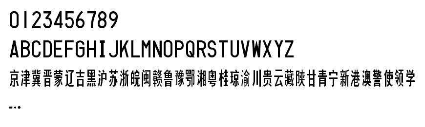

CN License A 是參照 GA 36-2007《中華人民共和國機動車號牌》當中的 440 × 140 mm 車號牌所使用的字體而造。

<!-- more -->

## 字元

分類 | 字元
-----|-----
數字 | `0` `1` `2` `3` `4` `5` `6` `7` `8` `9`
大楷 | `A` `B` `C` `D` `E` `F` `G` `H` `I` `J` `K` `L` `M` `N` `O` `P` `Q` `R` `S` `T` `U` `V` `W` `X` `Y` `Z`
小楷 | `a` `b` `c` `d` `e` `f` `g` `h` `i` `j` `k` `l` `m` `n` `o` `p` `q` `r` `s` `t` `u` `v` `w` `x` `y` `z`
簡體中文 | `京` `津` `冀` `晋` `蒙` `辽` `吉` `黑` `沪` `苏` `浙` `皖` `闽` `赣` `鲁` `豫` `鄂` `湘` `粤` `桂` `琼` `渝` `川` `贵` `云` `藏` `陕` `甘` `青` `宁` `新` `港` `澳` `警` `使` `领` `学`
繁體中文 | `晉` `遼` `滬` `蘇` `閩` `贛` `魯` `粵` `瓊` `貴` `雲` `陝` `寧` `領` `學`
其他 | `-`(U+002D) `•`(U+2022) `‧`(U+2027) `　`(U+3000)

## 下載

- [字型檔及字元表](CNLicenseA.zip)
