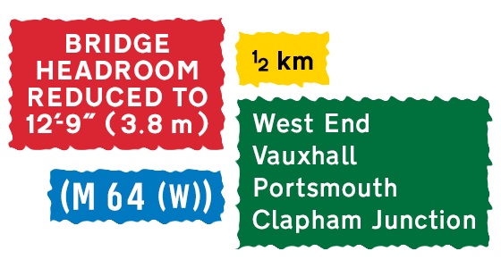

Highway Signage 概念乃源自英國道路指示牌所使用之字型，同時亦有加入用於高速公路編號的字符。Highway Signage 共有兩種粗幼度：Medium 及 Heavy。Medium 是用於藍﹑綠、啡底白字的指示牌；而 Heavy 則用於白、黃底黑字的指示牌。

<!-- more -->

Highway Signage 採用了部分 OpenType 功能。例如隨意分數、連體字和大楷斜綫位置微調。

為方便不支援 OpenType 字型名的軟件使用 Highway Signage（大多數 Windows 所附送的軟件都不支援），字型會在這些軟件中以 Regular 代表 Highway Signage Medium 及以 Bold 代表 Highway Signage Heavy。但在其他支援的軟件中仍會以 Medium 及 Heavy 作識別。

## 支援的 OpenType 功能

OpenType 功能 | 說明
--------------|-----
`aalt` (Access All Alternates) | 顯示字元所有替代字
`case` (Case-Sensitive Forms) | 大寫模式（用作大楷時的斜綫位置微調）
`onum` (Oldstyle Figures) | 舊式數字（用作切換高速公路編號字元）
`frac` (Fractions) | 分數（用作自組無分數線的分數）
`nmur` (Numerators) | 分子（用作自組無分數線的分數）
`dnom` (Denominators) | 分母（用作自組無分數線的分數）
`kern` (Kerning) | 字距調整
`liga` (Standard Ligatures) | 標準連體字
`salt` (Stylistic Alternates) | 替代字（用作標示其他替代字元）

## 特別字元

Unicode | 說明
--------|------
`U+E000` | Quote single + hyphen 連體字（因應設計標準而設）
`U+E001` | Space + hyphen + space 連體字（因應設計標準而設）
`U+E002` | 適用於大寫字的 slash（因應設計標準而設）
`U+E003` | 適用於大寫字的 backslash（因應設計標準而設）
`U+E050` | Double grave（方便組字）
`U+E051` | Inverted breve（方便組字）
`U+2004` | 空白字元（長 1.5 sw，因應設計標準而設）
`U+2005` | 空白字元（長 1.0 sw，因應設計標準而設）
`U+2006` | 空白字元（長 0.5 sw，因應設計標準而設）
`U+2007` | 空白字元（長 4.0 sw，因應設計標準而設）

## Stroke Width (sw)

Stroke Width（簡寫 sw）是道路指示牌設計標準的長度單位，4 sw 相當於字體的 x-height（小寫字母 x 的高度）。

- 預設的空白字元 (`U+0020`) 是 2.5 sw，如需使用其他長度請用 `U+2004` 至 `U+2007` 字元。
- Comma (`U+002C`) 後空白為 1.5 sw 已由字距調整 (kerning) 完成，輸入時先輸入逗號，然後空白即可。
- Hyphen (`U+002D`) 之間的 1.5 sw 空白已由連體字 (ligature) 完成，輸入時留意軟件是否支援 OpenType 連體字。
- Quote right (`U+2019`) 後留 0.5 sw 空白已由字距調整 (kerning) 完成。
- 如果與高速公路編號於同一行顯示時，標準規定高速公路編號需要上升 0.5 sw。字型內的高速公路編號字元已經預先上升 0.5 sw。

## 下載

- [字型檔及字元表](HighwaySignage.zip)

## 參考

- [Road Research Society 道路硏究社](https://www.facebook.com/RoadResearch/)
- [蘋果日報：【消失的字體】英式手造路牌字型夠懷舊 交通迷最愛](http://hk.apple.nextmedia.com/realtime/news/20160626/55277141)
