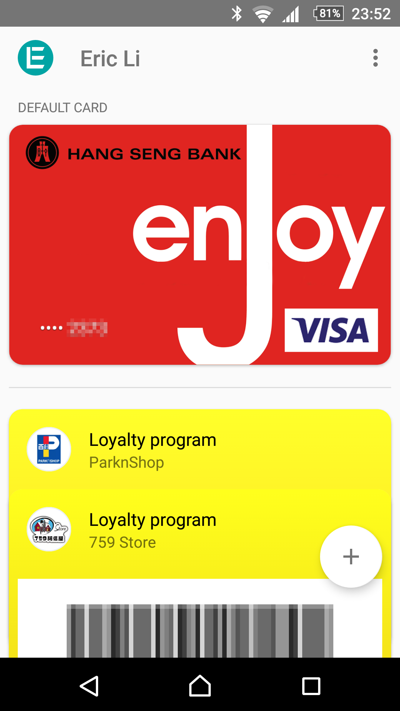

之前有傳聞在今個月推出的 Android Pay 終於在昨日正式登陸香港。目前支援滙豐、恆生、渣打、東亞、星展及大新銀行的 Visa 及 MasterCard 信用卡，Tap & Go 都可以加入去 Android Pay。我有一張恒生 Visa 和一張中銀 MasterCard，但因為不支援中銀的關係只可以加入恒生信用卡。

除了信用卡，Android Pay 可以加入會員卡。這個功能就是用來儲存會員卡的條碼，Android Pay 是不會檢查會員卡號碼的真確性。在付款前可以在電話展示條碼。這樣就可以不用帶太多會員卡，而且還會在你經過商鋪時提醒你可以用會員卡。不過有人在 759 阿信屋試過被職員拒絶，要他一定要出示實體會員卡。

<!--more-->

而我昨日在百佳試用 Android Pay 付款，過程尚算順利。首先我用 Android Pay 展示易賞錢條碼，收銀員以為我想用 Apple Pay。收銀員先用枱面的條碼機，但不成功。之後再出動手提條碼機，但亦不成功。最後要用鍵盤輸入會員卡號碼。之後到付款部分，過程就非常流暢。只需放上已解鎖並已開啟 NFC 的電話到拍卡機上面就馬上出現付款完成畫面。如果要使用非預設的信用卡，聽講要先在 Android Pay app 內點選信用卡進入詳細資料頁，然後才將電話放近拍卡機。

期望 Android Pay 會支援中銀，還有可以設成每次都可以輸入密碼、指紋才可以交易。更好的話可以支援與記帳 app 同步交易紀錄。

