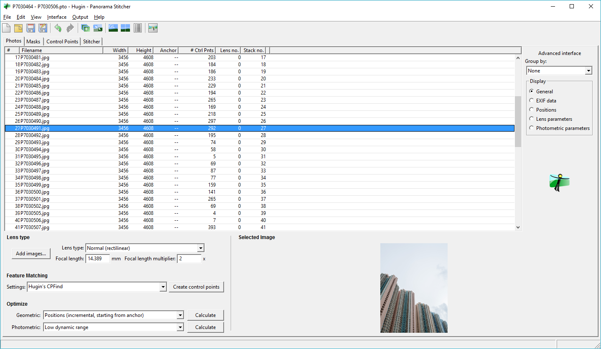
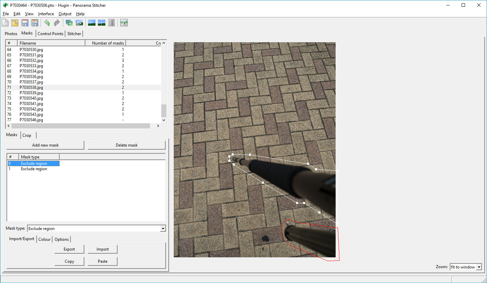
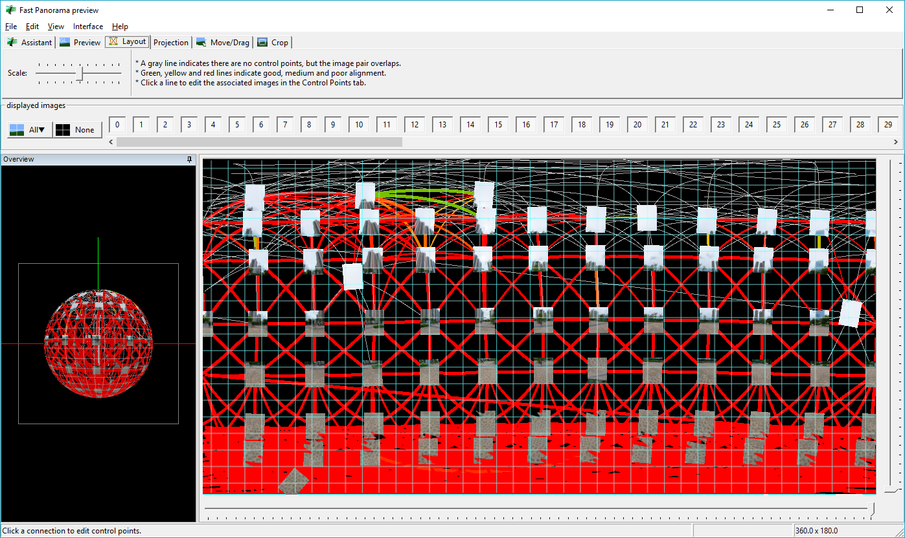
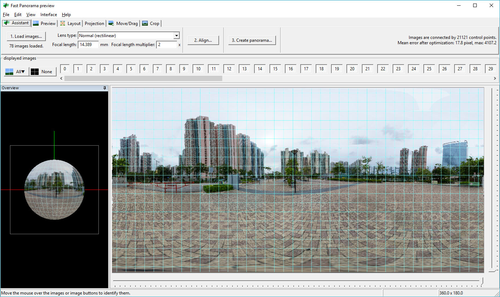
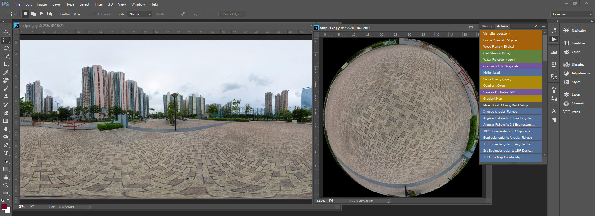

早前 Facebook 的 [360 Photos](https://facebook360.fb.com/360-photos/) 令 Photosphre 流行起來。沒有 360 camera 的話，可以用[手機應用程式](https://play.google.com/store/apps/details?id=com.google.android.street)駁相。不過用手機影相畫質會比較差。所以這次試試用相機拍攝 Photosphere。

<!-- more -->

以下是所需工具：

- 有全手動模式的相機
- 魚眼鏡 / 廣角鏡
- 三腳架
- Hugin
- Photoshop
- 能修改檔案 XMP 的工具

## 器材

按照 Google 的指引，用 DSLR 拍攝 Photosphere 的話，是需要用魚眼鏡。但因為我沒有魚眼鏡的關係，所以唯有用 14-42mm kit 鏡（135 等效焦距 28mm）拍攝。用魚眼鏡拍攝的好處是因為視角夠廣，拍攝張數少，後期駁相都會比較方便。但由於沒有魚眼鏡的關係所以拍了 70 多張相來接駁。拍攝時要調去全手動模式 (M mode)，對焦設成無限遠，ISO、光圈、快門、白平衡都要手動固定，否則接駁時可能會有明顥光暗差異。

緊記要用三腳架以確保位置固定在一個點。如果要講夠的話可以用全景雲台，但就算不用效果也是可以的。拍攝時要確保相片之間要預留足夠的重疊位置。[PhotosphereViewer.net](http://photosphereviewer.net) 提供了一個建議可以作參考：相機垂直，分 7 行影，水平角度影 14 張，之後慢慢將相機角度調向天上分別影 12 張、6 張、1 張，然後向地面做相同動作。不過拍到底部時要拿走腳架才拍。

## 後製

[Hugin](http://hugin.sourceforge.net/) 是一個開源的全景圖接駁軟件，它能支援不同的投射方式 (projection)。它支援 Photosphere 的 2:1 equirectangular projection。

開啟 Hugin 之後，可以先加入水平角度影的一行相片讓它自動接駁。用水平角度影的一行應該是最易接駁。留意要設定好鏡頭的焦距，因為它會按照焦距來將相片投射到球體內。如果相片見到腳架的話，可以Hugin 內置了不同的算法來尋找兩張圖的共通點，將相片加到 project 之後應該先用那些算法自動做一次先（揀選相片，然後按 Create control points 按鈕），如果效果不好才自己手動逐個共通點標註。留意揀選相片再按 Create control points 按鈕這個步驟要以人手揀選不同的相片組合再按 Create control points 按鈕。因為它有時不會尋找跨行相片的共通點。駁了大約一行後可以按一下 Optimize 部分的 calculate 按鈕，讓它計算相片的位置。

這個步驟的目標就是要「織網」：即是將不同的相片以共通點連接，連接不單止是同一行，還要跨行。否則相片不能接駁成球體。要查看「織網」的效果，按一下 Fast panorama preview 按鈕（頂部寫有 GL 的按鈕），再轉到 Layout tab 就可以看到。如果「織網」效果不滿意，可以返回 Panorama Stitcher 視窗再揀選未有連結的兩張圖，再按一下 Create control points 按鈕。如果一次過揀選太多圖片來找共通點的話可能「織網」時會有遺漏。

之後可以轉到 Preview tab 預覧效果。如果滿意的話可以將圖片匯出。留意匯出的圖片太大的話可能會因記憶體不足而失敗。匯出完成後可以用 [PhotosphereViewer.net](http://photosphereviewer.net) 預覽。

預覽時可能會發現頂部和底部都不能完全填滿﹑還見到小小腳架，或者端點駁位特別明顯，但用 Photoshop 修補又很難。Equirectangular projection 的特點就是頂部 (zenith) 和底部 (nadir) 會嚴重變形，如果直接修改的話會非常困難。所以這時要用 [The Domemaster Photoshop Actions Pack](http://www.andrewhazelden.com/blog/2012/11/domemaster-photoshop-actions-pack/) Photoshop action 將頂部和底部還原。

裝好 The Domemaster Photoshop Actions Pack 之後，開啟之前匯出好的全景相，然後複製多一個文件出來 (Image | Duplicate)。如果要修改底部的話，就要先將圖片 180 度反轉。之後在 Action 面板選擇「2:1 Equirectangular to Angular Fisheye」。還原後會變成一個圓形的圖片，這時就可以用平時慣用的工具（例如 Clone stamp tool）來修補。如果懶的話可以放一個圓形的圖案遮蓋住底部，圖案可以是你的 logo 或者指南針之類。改好之後就合併所有圖層，之後在 Action 面板選擇「Angular Fisheye to 2:1 Equirectangular」。圖片就會變成 equirectangular projection，這就可以將該圖片放回原先的全景圖內。留意相片尺寸不可以太大，否則 Photoshop 不能處理。還有做完 Angular Fisheye to 2:1 Equirectangular Action 後圖片會被拉高，只需在放上去原圖時將高度縮小一半就可以了。

最後就是為全景圖加上 [Photosphere XMP metadata](https://developers.google.com/streetview/spherical-metadata)。我自己就用 Adobe Bridge 的面板加上 data panel 來加工，但其實可以用其他改 EXIF 和 XMP 軟件修改。除了 Photosphere XMP metadata 外，還可以加上相片拍攝位置的座標，方便分享到 Google Maps、Facebook、Flickr 等等的網站。Photosphere XMP metadata 有一項叫 `PoseHeadingDegrees` 是用來指明北面是在那方，但在 Facebook 試過發現它好像沒有用到這個數值。所以最好的方法都是在 Hugin 裏調節好方向。只需在 Hugin 的 Fast panorama preview 視窗按「Move/Drag」tab，然後按住 Shift 的同時左右 drag 全景圖就可以調整方向，將北面的景放到整張全景點的正中央就可以了。下面就是完成品（因為我之前已經上載了，所以沒有再修正方向問題）：

<iframe src="https://www.google.com/maps/embed?pb=!1m0!3m2!1szh-TW!2shk!4v1469931300840!6m8!1m7!1sF%3A-Dl2hloj8eUI%2FV4ErF85dxLI%2FAAAAAAABSqw%2FQHJcmz_BjvIzKiqmjXOCbEtIAH4GNTGfgCLIB!2m2!1d22.466044!2d114.0017085!3f226.9019464826737!4f-56.8869752417503!5f0.7820865974627469" width="100%" height="600" frameborder="0" style="border:0" allowfullscreen></iframe>

其實可以見到 Hugin 會駁錯，可能是因為用了太多相片去駁，加上可能 Hugin 算法找錯共通點（大廈外牆其實層層都差不多，差異主要是在窗門曬的衣服和冷氣機；地磚就更難駁）。如果要用人手修正 / 補加共通點會花太多時間。如果想大量拍攝 Photosphere 的話最好都是買一支魚眼鏡。

## 參考

- [making360 - Patching Nadir](http://making360.com/patching-nadir/)
- [Photo Sphere XMP 中繼資料](https://developers.google.com/streetview/spherical-metadata)
- [How to add mandatory Photo Sphere meta data to an equirectangular image (Photoshop CC 2014)](http://www.panotwins.de/technical/how-to-add-mandatory-photo-sphere-meta-data-to-an-equirectangular-image-photoshop-cc-2014/)
